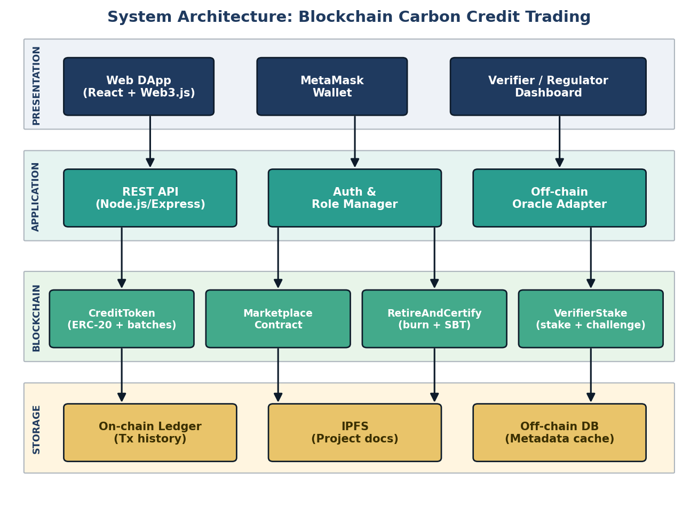
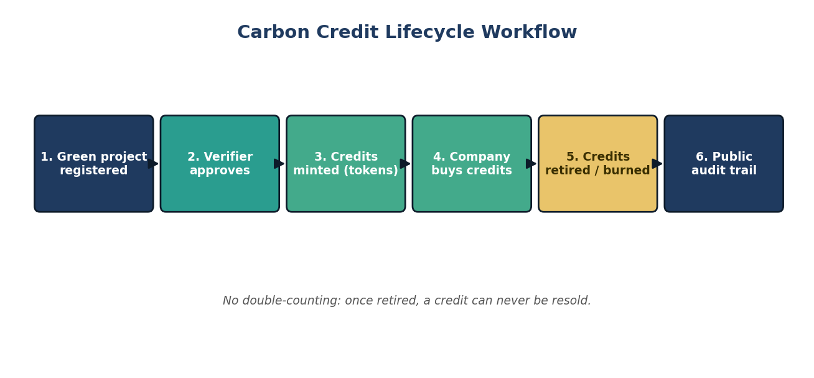
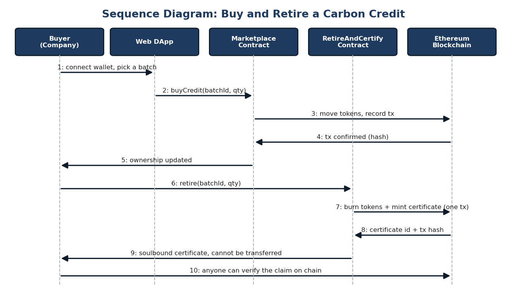
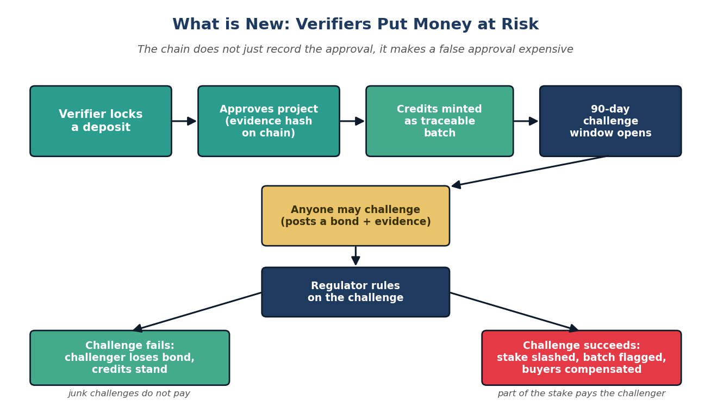
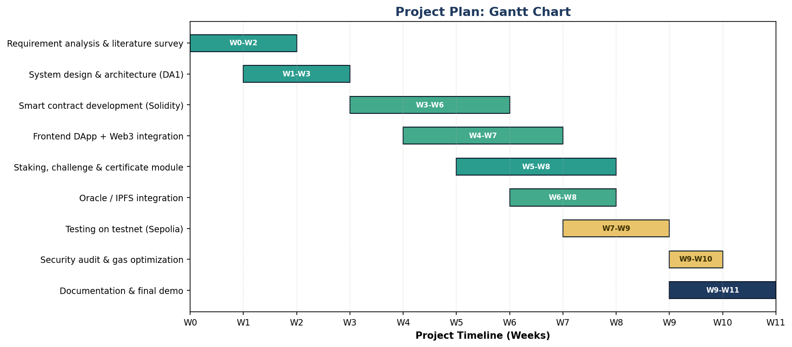

# Blockchain Based Carbon Credit Trading System

**Blockchain Technology — Digital Assignment 1 (design) + Digital Assignment 2 and 3 (implementation)**
**SDG 13, Climate Action** (also supports SDG 7 and SDG 12)
**By:** Avi Dhandhania (25BCE1207), Shivesh Kumar (25BCE1067)

A public Ethereum system that turns carbon credits into tokens and keeps their whole life on a ledger anyone can read: mint, trade, then **retire by burning**. That much removes double counting.

The part we have not found elsewhere is what happens when the data going in is a lie. Verifiers have to **lock a deposit** before approving a project and lose it if the project is later shown to be fake, anyone can challenge a batch and get paid out of the slashed stake, and burning credits mints a **soulbound certificate** so an offset claim has a public owner and cannot be resold as proof. See Section 4.4 of the DA1 report and Section 3.2 of the DA2 report.

## Status

| | |
|---|---|
| **DA1 — design** | Complete: report, presentation, diagrams |
| **DA2 — core implementation** | 4 smart contracts, test suite, React frontend, deploy script |
| **DA3 — roadmap features** | Regulator multisig, configurable windows, MRV oracle, fractionalization, pro-rata compensation |

Live status, roadmap tracker and known limitations: **[`PROGRESS.md`](PROGRESS.md)**.

## DA1 Deliverables

| Deliverable | Location |
|-------------|----------|
| Full report (Word) | [`docs/DA1_Report.docx`](docs/DA1_Report.docx) |
| Report (Markdown, renders on GitHub) | [`docs/DA1_Report.md`](docs/DA1_Report.md) |
| Presentation (PowerPoint) | [`presentation/DA1_Presentation.pptx`](presentation/DA1_Presentation.pptx) |
| Design diagrams (PNG) | [`diagrams/`](diagrams/) |

## DA2/DA3 Deliverables

| Deliverable | Location |
|-------------|----------|
| DA2 report (Markdown) | [`docs/DA2_Report.md`](docs/DA2_Report.md) |
| Smart contracts (Solidity 0.8.20, 6 contracts) | [`contracts/`](contracts/) |
| Test suite (109 passing) | [`test/`](test/) |
| End-to-end check (25 assertions) | [`frontend/scripts/verify-integration.mjs`](frontend/scripts/verify-integration.mjs) |
| Browser check (13 assertions, headless Chrome) | [`frontend/scripts/browser-check.mjs`](frontend/scripts/browser-check.mjs) |
| Deploy script | [`scripts/deploy.js`](scripts/deploy.js) |
| React frontend | [`frontend/`](frontend/) |

### DA3 additions

| Feature | Where |
|---------|-------|
| 3-of-5 regulator multisig gates challenge resolution | `contracts/RegulatorMultisig.sol` |
| Per-batch configurable challenge window (1–365 days) | `VerifierStake.setBatchChallengeWindow` |
| MRV oracle attestation for minting | `contracts/interfaces/IMRVOracle.sol`, `contracts/MockMRVOracle.sol` |
| Batch fractionalization (supply-invariant) | `CreditToken.splitBatch` |
| Per-batch compensation pools, pro-rata to buyers | `VerifierStake.claimCompensation` |

---

# Running the project

## 1. Prerequisites

- Node.js 18, 20 or 22 (this machine runs 24 — Hardhat only prints an unsupported-version warning, everything still works)
- MetaMask (or any wallet that injects `window.ethereum`)
- Python 3 only if you want to rebuild the DA1 report/diagrams

```bash
npm install
```

## 2. Compile and test

```bash
npx hardhat compile                  # compile the contracts
npx hardhat test                     # 109 tests, all passing
npx hardhat coverage                 # optional coverage report
REPORT_GAS=true npx hardhat test     # optional gas report
```

## 3. Run the local chain and deploy

Three terminals. **The node must stay open** — the chain lives in memory, so closing it wipes all deployed contracts and data.

```bash
# Terminal 1 — local chain on 127.0.0.1:8545 (chain ID 31337)
npm run node

# Terminal 2 — deploy the 4 contracts and grant roles
npm run deploy:local

# Terminal 3 — frontend at http://localhost:3000
npm run frontend
```

On a fresh chain the deploy script always produces these addresses:

| Contract | Address |
|----------|---------|
| CreditToken | `0x5FbDB2315678afecb367f032d93F642f64180aa3` |
| Marketplace | `0xe7f1725E7734CE288F8367e1Bb143E90bb3F0512` |
| RetireAndCertify | `0x9fE46736679d2D9a65F0992F2272dE9f3c7fa6e0` |
| VerifierStake | `0xCf7Ed3AccA5a467e9e704C703E8D87F634fB0Fc9` |

These are already filled into [`frontend/src/utils/contracts.js`](frontend/src/utils/contracts.js). They are derived from the deployer's nonce, so if you deploy a second time on the **same** running node the addresses shift (nonces 5–8 on the second run) and `contracts.js` must be updated to match.

## 4. Connect MetaMask

1. **Add the network:** RPC URL `http://127.0.0.1:8545`, Chain ID `31337`, symbol `ETH`. MetaMask will warn that chain 31337 is registered as "GoChain Testnet" in its public list — ignore that, your local node is what you want. The app's orange "wrong network" banner also has a **Switch to Localhost (Hardhat)** button that adds it for you.
2. **Import the funded account:** the deployer account, which is the only one holding roles. In MetaMask: *account menu → Add account or hardware wallet → Import a private key* and paste

   ```
   0xac0974bec39a17e36ba4a6b4d238ff944bacb478cbed5efcae784d7bf4f2ff80
   ```

   → address `0xf39Fd6e51aad88F6F4ce6aB8827279cffFb92266` with ~10,000 ETH.
   (These are Hardhat's well-known public test keys — never use them for real funds.)
3. Open `http://localhost:3000`, click **Connect MetaMask**, approve, and pick that account.

Optional second account, useful for testing a real purchase (one wallet sells, the other buys):

```
0x59c6995e998f97a5a0044966f0945389dc9e86dae88c7a8412f4603b6b78690d   →  0x70997970C51812dc3A010C7d01b50e0d17dc79C8
```

**Use the deployer account for everything except buying.** Minting, retiring and staking all check for a role, and the frontend has no role-grant screen — so a freshly imported account gets rejected with `AccessControlUnauthorizedAccount`. Buying needs no role, which is why the trading flow works with a second account:

```bash
npm run node                       # terminal 1
npm run deploy:local               # terminal 2
npm run frontend                   # terminal 3
```

## 5. Deployment to Sepolia (optional)

```bash
cp .env.example .env       # fill in SEPOLIA_RPC_URL, PRIVATE_KEY, ETHERSCAN_API_KEY
npm run deploy:sepolia
npm run verify:sepolia -- <address> <constructor args>
```

`COMPENSATION_POOL` (optional) sets the address that receives slashed stakes. It defaults to the deployer. Point it at an address you can actually withdraw from — not at another protocol contract.

---

# What is implemented

## Smart contracts

| Contract | Standard | Roles | Purpose |
|----------|----------|-------|---------|
| [`CreditToken.sol`](contracts/CreditToken.sol) | ERC-20 + burnable + AccessControl | `MINTER_ROLE`, `VERIFIER_ROLE` | Credits with per-batch tracking |
| [`Marketplace.sol`](contracts/Marketplace.sol) | AccessControl + ReentrancyGuard | `BUYER_ROLE`, `MARKETPLACE_ADMIN_ROLE` | Listings, buying, price updates |
| [`RetireAndCertify.sol`](contracts/RetireAndCertify.sol) | ERC-721 URI storage + AccessControl | `RETIRE_ROLE`, `REGULATOR_ROLE` | Burn credits, mint soulbound certificates |
| [`VerifierStake.sol`](contracts/VerifierStake.sol) | AccessControl + ReentrancyGuard | `VERIFIER_ROLE`, `REGULATOR_ROLE`, `CHALLENGER_ROLE` | Stakes, challenges, slashing |

**CreditToken** mints a `Batch` per project (`projectId`, `verifier`, `ipfsHash`, `amount`, `timestamp`, `isFlagged`) and keeps `batchBalances[batchId][holder]` in sync on every transfer, so a credit bought on the marketplace is still traceable to the batch it came from. `retireBatch` / `retireBatchFrom` burn credits, and an admin can `flagBatch` a fraudulent batch to block it from being traded or retired.

**Marketplace** lets a holder list credits from a batch at a price in ETH. Buyers pay in one transaction; the contract transfers the credits and forwards the ETH to the seller, refunding any excess. Fully bought listings deactivate themselves.

**RetireAndCertify** burns credits and mints an ERC-721 certificate of retirement in the same transaction. `_update`, `approve` and `setApprovalForAll` all revert, so the certificate is soulbound — it can never be transferred, approved or resold.

**VerifierStake** is the novel part. A verifier must deposit ≥ 1 ETH before approving projects. Within the challenge window (90 days by default, configurable per batch between 1 and 365 days) anyone can open a challenge by posting a 0.1 ETH bond plus an IPFS evidence hash.

The window is resolved by a **3-of-5 regulator multisig**, not a single key — the deployer's own regulator role is revoked at deploy time. A resolution is proposed once and executes automatically on the third approval. Then:

- **Challenger wins** — half the verifier's stake is slashed: a quarter to the challenger (on top of their returned bond) and a quarter into that batch's **compensation pool**, which buyers draw from pro-rata via `claimCompensation`. The batch is flagged, and the slashed verifier cannot claim from its own pool.
- **Verifier wins** — the stake is untouched and the challenger forfeits their bond.

While a challenge is open the verifier cannot withdraw their stake, so they cannot exit ahead of a ruling.

**RegulatorMultisig** holds `REGULATOR_ROLE` on VerifierStake. Owners can be rotated by a threshold action, and the panel refuses to shrink below its own threshold.

**CreditToken** also supports **fractionalization**: `splitBatch` moves part of a batch into a child batch that inherits the verifier and evidence, without minting anything, so total supply is invariant. And when an MRV oracle is wired in, `mintBatch` additionally requires an approved project with a matching evidence hash.

## Frontend

React 18 + Vite 5 + ethers v6, wallet via MetaMask. One `BrowserProvider`/signer is created in `App.jsx` and passed to every panel; contract addresses and human-readable ABIs live in [`frontend/src/utils/contracts.js`](frontend/src/utils/contracts.js).

| Component | What it does |
|-----------|--------------|
| `WalletConnect.jsx` | Connect/disconnect, network badge, switch to Localhost or Sepolia |
| `CreditTokenPanel.jsx` | Mint a batch, retire credits, list minted batches |
| `MarketplacePanel.jsx` | Create/cancel listings, buy credits, view active and own listings |
| `RetireCertifyPanel.jsx` | Retire credits and mint a soulbound certificate, view certificates |
| `VerifierStakePanel.jsx` | Deposit/withdraw stake, open a challenge, claim buyer compensation, configure challenge windows |
| `RegulatorMultisigPanel.jsx` | View the panel, propose a resolution, approve it, execute |

**A walkthrough that exercises everything** (all steps from the deployer account unless noted):

1. 🪙 **Credit Token** → mint `PROJ-001` / `QmTestHash123` / `1000` → supply becomes 1000 CC, batch #1 appears.
2. 🏪 **Marketplace** → create a listing for batch `1`, amount `100`, price `0.00001` ETH (two MetaMask confirmations: approve, then list).
3. Optional: switch MetaMask to the second account, **Connect** it to the site from MetaMask's footer, and buy `50` CC — you pay `0.0005 ETH` and the batch balance moves to the buyer.
4. 🪙 **Retire Credits** → batch `1`, amount `25` → supply drops to 975 CC.
5. 📜 **Retire & Certify** → batch `1`, `25`, `ipfs://QmCert1` → certificate #1 is minted and cannot be transferred.
6. 🛡️ **Deposit Stake** → `1` ETH.
7. 🛡️ **Create Challenge** → batch `1`, evidence `QmEvidence1` (0.1 ETH bond).
8. 🛡️ **Withdraw Stake** → `1` — this is *expected to revert* with `Active challenges exist`: the stake is locked while a challenge is open.
9. 🏛️ **Regulator Multisig** → *Propose Resolution* → challenge `1`, *Challenger Wins*. Then approve it from **three different accounts**: switch MetaMask to accounts #1 and #2 and hit *Approve*. The resolution fires automatically on the third approval — the verifier's stake drops to 0.5 ETH, the batch is flagged, and the challenger is paid their bond plus a quarter of the slash. (Trying to resolve directly as the deployer now reverts, which is the point.)
10. 🛡️ **VerifierStake** → under *Claim Buyer Compensation*, enter batch `1` to see the pool. If that batch spread across accounts it pays each holder pro-rata; the verifier who was slashed is rejected.

Note that once a batch is flagged in step 9 it can no longer be listed or retired — that is the point of flagging, so resolve as *Verifier Wins* instead if you want to keep trading that batch.

If you would rather demo the single-key flow, deploy with `KEEP_DEPLOYER_REGULATOR=true`.

## Tests

`npx hardhat test` — **109 passing**, covering all six contracts and the revert paths.

| Suite | Tests | Covers |
|-------|-------|--------|
| CreditToken | 11 | Mint, retire, flag, roles, batch balances |
| Marketplace | 12 | List, buy, cancel, price update, refunds, roles |
| RetireAndCertify | 9 | Retire+certify, metadata, soulbound enforcement |
| VerifierStake | 12 | Stake, withdraw, challenge, resolve, slashing payouts, stake lock |
| CreditToken DA3 | 21 | Fractionalization, transfer freeze, supply invariants, MRV oracle gating |
| VerifierStake DA3 | 23 | Configurable windows, per-batch pro-rata compensation, claimant freeze |
| RegulatorMultisig | 21 | Threshold approval, owner rotation, execution guards |

Sub-run breakdown of the DA3 rows: `batch fractionalization` 13 + `MRV oracle` 8 = 21;
`configurable challenge window` 10 + `per-batch compensation pool` 13 = 23.
Total: 11 + 12 + 9 + 12 + 21 + 23 + 21 = **109**.

There is also an end-to-end check that drives the deployed contracts through the **same ABIs the
frontend uses**, so a broken ABI string is caught rather than silently failing in the browser:

```bash
npx hardhat node                                       # terminal 1 (fresh)
npx hardhat run scripts/deploy.js --network localhost  # terminal 2
cd frontend && node scripts/verify-integration.mjs     # 25 assertions
```

And a **browser check** that loads the real dev server in headless Chrome, connects through the app's
own wallet flow against an injected EIP-1193 provider, and asserts what the DOM actually paints —
all panels present, Total Supply bound to chain state, the multisig threshold and owners rendered,
no console errors:

```bash
cd frontend && node scripts/browser-check.mjs          # 13 assertions + screenshot
```

## Diagrams

| | |
|---|---|
| System architecture |  |
| Credit lifecycle |  |
| Sequence, buy and retire |  |
| Stake, challenge and slash (the new part) |  |
| Project gantt |  |

## Project structure

Build output is **not** committed — `artifacts/`, `cache/` and `frontend/dist/` are gitignored and
regenerated by `npx hardhat compile` and `npm run build`. That keeps the repository to source and docs.

```
├── contracts/                     # Solidity 0.8.20 (viaIR, optimizer 200 runs)
├── test/                          # 109 tests across the core and DA3 suites
├── scripts/deploy.js              # deploys 6 contracts + grants/revokes roles
├── PROGRESS.md                    # status, roadmap tracker, known limitations
├── frontend/                      # React + Vite frontend
│   └── src/
│       ├── components/            # one panel per module
│       ├── scripts/               # verify-integration.mjs + browser-check.mjs
│       ├── utils/contracts.js     # addresses & ABIs
│       └── App.jsx                # wallet connection
├── diagrams/                      # generated PNGs + make_diagrams.py
├── docs/                          # DA1 and DA2 reports
├── presentation/                  # DA1 slides
├── build_deliverables.py          # rebuilds the DA1 .docx/.pptx
├── hardhat.config.js
└── package.json
```

## Rebuilding the DA1 deliverables

```bash
pip install python-pptx python-docx matplotlib pillow
python diagrams/make_diagrams.py     # regenerate the diagram PNGs
python build_deliverables.py         # rebuild DA1_Report.docx and DA1_Presentation.pptx
```

Note: the report text lives in two places, `docs/DA1_Report.md` and `build_deliverables.py`. Edit both or they drift.

## Tech stack

Implemented in DA2: Solidity 0.8.20 with OpenZeppelin 5 (ERC-20, ERC-721, AccessControl, ReentrancyGuard), Hardhat 2, Chai + ethers v6 for tests, React 18 + Vite 5 + ethers v6 for the frontend, MetaMask for signing, and the Hardhat local chain / Sepolia for deployment.

Still planned: IPFS pinning (only content hashes are used today), a Layer 2 (Polygon or Arbitrum) for production, and the DA3 items listed in Section 4 of the DA2 report — multi-sig regulator, configurable challenge windows, MRV oracles and fiat on/off-ramps.
