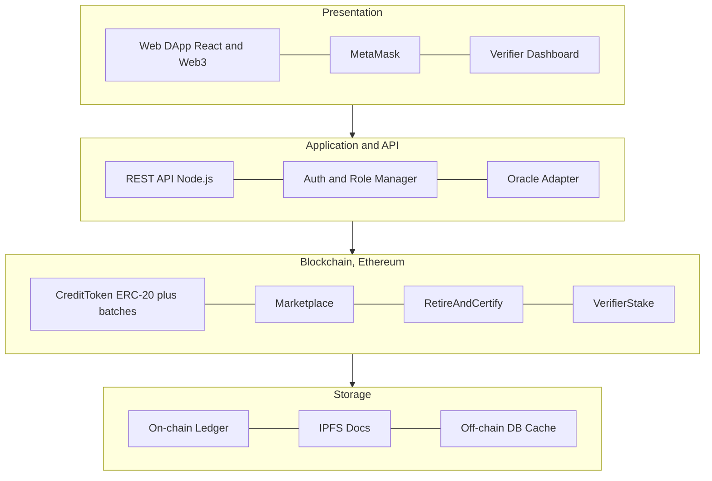

# DA1: Blockchain Based Carbon Credit Trading System

**Course:** Blockchain Technology · **Assessment:** Digital Assignment 1 (DA1)
**SDG:** SDG 13, Climate Action (also supports SDG 7 and SDG 12)
**Submitted by:** Avi Dhandhania (25BCE1207), Shivesh Kumar (25BCE1067)

---

## 1. Problem Statement, Objectives and Scope

### 1.1 The problem

One carbon credit is permission to release one tonne of CO2. A company that pollutes less than its allowance can sell the credits it did not use. A company that pollutes more has to buy them. On paper this pays companies to cut emissions, and it should work.

In practice the market has a trust problem. The same four issues keep coming up.

**The same credit gets counted twice.** Registries are separate databases run by separate bodies, and they do not talk to each other. A credit sold in one registry can be sold again in another, and nobody notices.

**Buyers cannot check what they bought.** If a company buys 10,000 credits from a tree planting project, it has no way to confirm that the trees exist. It has to trust a PDF.

**Some credits are for projects that never happened.** These are called phantom credits. Journalists have found cases where a large share of a registry's credits did not represent any real reduction. Because the records sit in private databases, this only comes out years later, if at all.

**Checking is slow and expensive.** Approval and settlement still run on manual audits and paperwork. It can take months, and the fees come out of money that was supposed to go into climate projects.

The result is that a system built to reduce emissions ends up letting companies claim reductions that never happened.

### 1.2 Objectives

**O1.** Turn each carbon credit into a token on a public blockchain so it has one identity and cannot be copied.

**O2.** Handle issuing, selling and retiring credits in smart contract code, so double counting is blocked by the rules of the system and not by someone remembering to check.

**O3.** Keep the whole history of every credit on a ledger that anyone can read and nobody can edit.

**O4.** Cut out middlemen so verification is faster and cheaper.

**O5.** Give the four kinds of users (project developer, verifier, buyer, regulator) separate on chain roles, so only the right person can do each action.

**O6.** Make verifiers pay for bad approvals. A verifier has to lock money before signing off on a project, and loses it if the project is later shown to be fake. This is the part we have not seen in existing work, and it is described in Section 4.4.

### 1.3 Scope

**What DA1 covers:** the design of a decentralised app (DApp) on Ethereum. This includes an ERC-20 token for credits, a marketplace contract for listing and buying, a retirement contract that burns credits and issues a certificate, a staking and challenge contract for verifiers, role based access control, IPFS for project documents, and a dashboard where anyone can look up a credit.

**What DA1 does not cover:** connecting to government registries, legally binding settlement, buying credits with real money, and any machine learning estimate of how much CO2 a project actually saved. DA1 is the problem study, the literature review, the justification for using blockchain, the architecture and the plan. Writing the contracts comes later.

### 1.4 How this maps to the SDGs

| SDG | What the project does for it |
|-----|------------------------------|
| SDG 13, Climate Action (main) | Makes offsets trustworthy, so money spent on credits funds real emission cuts. |
| SDG 7, Affordable and Clean Energy | Solar and wind projects can sell credits that buyers actually believe in. |
| SDG 12, Responsible Consumption and Production | Public records make greenwashing easy to spot. |

---

## 2. Literature Survey and Research Gap

### 2.1 What already exists

| # | Work | What it did well | Where it falls short |
|---|------|------------------|----------------------|
| 1 | Toucan Protocol (Base Carbon Tonne) | Moved real credits onto Ethereum as tokens and added on chain retirement. | Everything depends on trusting the bridge. It was criticised for bringing old, low quality credits on chain, which put good tokens and junk tokens in the same pool. |
| 2 | KlimaDAO | Used tokenised credits as a treasury asset to push the carbon price up. | The goal is financial, not honest accounting. It does not check whether a credit is real. |
| 3 | IBM and Energy Web pilots | Enterprise blockchains for tracking company emissions. | Permissioned, so only members can read the ledger. The public and regulators are locked out, which is the group that most needs to check. |
| 4 | Verra and Gold Standard registries | Well developed methods for measuring a project, plus human auditors. | Central databases that do not reconcile with each other. Double counting and slow settlement are still normal. |
| 5 | Academic surveys on blockchain carbon trading, 2019 to 2023 | Showed that smart contract trading is workable and modelled parts of it. | Mostly stay at concept level. Few cover the full mint, trade and retire path with role control and evidence anchoring together. |
| 6 | EU ETS and other economic models | Model how an emissions trading scheme behaves as a market. | Assume the records are correct. They do not deal with the trust layer at all. |

### 2.2 The gaps we found

**G1. The lifecycle is handled in pieces.** Most systems tokenise credits, or trade them, or retire them. Few enforce the order, so the rule "a retired credit can never be sold again" is often a policy rather than something the code refuses to do.

**G2. Off chain evidence is loosely attached.** When a credit is bridged from an old registry it carries the same weaknesses it had there. The verifier's signature and the project documents are usually kept somewhere else, so a token on its own tells you very little about where it came from.

**G3. Public chains have transparency but weak governance.** Public systems let anyone read the ledger, but they rarely combine that with strict on chain roles for developer, verifier, buyer and regulator.

**G4. Nothing happens to a verifier who approves a fake project.** This gap is the important one. Every design above assumes the data entering the chain is honest. If a verifier signs off on a project that does not exist, the blockchain records that lie perfectly and forever. The verifier faces no on chain consequence, and buyers who paid for those credits have no way to get anything back. Papers name this the "garbage in, garbage out" problem and then move on.

**What we do about them.** We design one public Ethereum system that keeps the lifecycle order in contract code (G1), stores the verifier's signature and an IPFS hash of the evidence with every batch of credits (G2), and puts role based access control on top of a public ledger (G3). For G4 we add a stake and challenge mechanism, plus batch tracing and a non transferable retirement certificate. Section 4.4 explains these.

---

## 3. Is Blockchain the Right Choice Here?

### 3.1 Does this need a blockchain at all?

It is worth asking, because plenty of projects use a blockchain where a database would do. The usual test is four questions. Do several parties who do not trust each other need to share the same data? Should no single organisation own that data? Is a record that cannot be edited necessary? Does removing middlemen help?

Carbon trading answers yes to all four. Polluters, project developers, verifiers, regulators and the public all have different interests and do not fully trust one another. The record has to survive attempts to edit it, because the whole point is to prove what happened. And cutting out slow intermediaries is one of our objectives.

There is also a simpler argument. A single registry with one owner and one database is exactly what the market has now, and that is the thing that failed.

### 3.2 Ethereum or Hyperledger Fabric?

| Criterion | Ethereum (public) | Hyperledger Fabric (permissioned) |
|-----------|-------------------|-----------------------------------|
| Who can join | Anyone can read and verify | Only invited members |
| Public audit | Full, which is what we need | Only within the consortium |
| Tokens | Built in through ERC-20 and ERC-721 | Needs custom chaincode |
| Trust model | Trustless | Members trust each other |
| Cost | Gas fees, reducible with Layer 2 | No gas, but servers to run |
| Speed | Slower on L1, fast on L2 | Fast |

### 3.3 We chose public Ethereum

The deciding factor is who needs to check the records. Credits have to be verifiable by regulators, journalists, NGOs and ordinary people, not just by the companies in a consortium. That rules out a permissioned ledger straight away.

Three other reasons back it up. ERC-20 and ERC-721 already match what we need, where one credit is one token that cannot be duplicated. The tooling around Ethereum is the most mature, so Solidity, OpenZeppelin, Hardhat, MetaMask and free testnets are all available and well tested, which matters for security. And Layer 2 networks like Polygon and Arbitrum bring gas costs down far enough that the cost argument stops being a real objection.

Hyperledger would be the better pick if credits were traded quietly among a fixed set of known companies. That is the opposite of what we want.

---

## 4. Architecture, Workflow and Design

### 4.1 System architecture

The system has four layers. See `diagrams/architecture.png`.

**Presentation layer.** A React web app that talks to the chain through Web3.js, MetaMask for signing transactions, and a dashboard for verifiers and regulators.

**Application layer.** A Node.js REST API, a role manager that maps a wallet address to a role, and an adapter that pulls in off chain data such as satellite or sensor readings for a project.

**Blockchain layer (Ethereum).** Four contracts. `CreditToken` is the ERC-20 token and also keeps a record for each batch. `Marketplace` handles listing and buying. `RetireAndCertify` burns credits and issues the certificate. `VerifierStake` holds verifier deposits and runs the challenge process.

**Storage layer.** The chain itself for transaction history, IPFS for large project documents where only the hash goes on chain, and an ordinary database that caches metadata so the dashboard loads quickly. The cache holds nothing that matters; if it is lost it can be rebuilt from the chain.

### 4.2 The life of a credit

See `diagrams/workflow.png`.

1. A developer registers a green project, such as reforestation or rooftop solar, and uploads the supporting documents to IPFS.
2. A verifier locks a deposit and approves the project. The approval, the verifier's address and the IPFS hash of the evidence all go on chain.
3. Credits are minted as a batch. One token equals one tonne of CO2. The batch keeps a link back to the project and the verifier who approved it.
4. A company buys credits through the marketplace contract.
5. To claim the offset, the company retires the credits, which burns them.
6. The retirement contract issues a certificate to the buyer's address. The certificate cannot be transferred or sold.
7. All of this stays readable by anyone. During the challenge window the batch can still be disputed, and after that it is settled.

Because retirement is a burn, a retired credit cannot be sold again. That is not a rule someone has to enforce; there is simply nothing left to sell.

### 4.3 Sequence for buying and retiring

See `diagrams/sequence.png`. The buyer connects a wallet and picks a listing. The DApp calls `buyCredit(batchId, qty)`. The marketplace contract moves the tokens and the transaction is recorded on Ethereum. Once it is confirmed, the buyer calls `retire(batchId, qty)`. The tokens are burned and the contract issues the certificate in the same transaction, so the burn and the proof of the burn cannot come apart. The buyer ends up with a transaction hash and a certificate that is anchored to their address.

### 4.4 What is new in our design

Everything in Section 4.1 to 4.3 is engineering that others have done in some form. This section is the part we have not found in the systems we surveyed. See `diagrams/novelty.png`.

**Verifiers put money at risk.** Right now a verifier signs a report and walks away. In our design a verifier must lock a deposit in `VerifierStake` before approving anything, and the deposit stays locked through a challenge window of about 90 days per batch. Anyone can challenge a batch during that window by posting a smaller bond and an IPFS link to their evidence, such as satellite images showing bare land where a forest was claimed. An address holding the regulator role rules on the challenge. If the challenge succeeds, the verifier's stake is slashed. Part goes to the challenger, which pays people to look for fraud, and part goes into a compensation pool for the buyers of that batch. If the challenge fails, the challenger loses their bond, which stops people filing junk challenges. A verifier whose stake falls below the minimum loses the ability to approve anything until they top it up.

This changes what the blockchain is doing. In the systems we reviewed the chain is a very good filing cabinet: it records whatever it is told, including lies. Here the chain also holds the incentive. Approving a fake project stops being free.

**Every credit can be traced back and flagged.** Each mint creates a batch that stores the project ID, the verifier who approved it and the IPFS hash of the evidence. So a token is never anonymous. If a project is later proven fake, the contract can mark every batch that came from it, and the dashboard shows a warning on each of those credits and on every wallet still holding them. Compare this with a token pool where good and bad credits are mixed together and one bad project quietly damages the value of the whole pool. Being able to name the affected credits is what makes compensation possible at all.

**The retirement certificate cannot be traded.** When credits are burned, the contract mints an ERC-721 token to the buyer with transfer disabled, which is a soulbound token. It records how many tonnes were retired, which batch they came from, the date and who claimed the offset. This matters for two reasons. A company can point an auditor or a customer at a public certificate instead of a spreadsheet it wrote itself. And because the certificate cannot move, the same retirement cannot be resold as proof to a second company. Today a burn is only a hole in the supply and nothing says who the hole belongs to, so two companies can both point at it. Here the claim has an owner.

**Together these three close G4.** Evidence is bound to the credit, someone loses money if the evidence was false, anyone can start that process, and the offset claim at the end is public and cannot be reused. The chain stops only proving that a record exists and starts giving people a reason to file honest records in the first place.

**What we are not claiming.** Staking does not make fraud impossible. A verifier who profits more than the stake is worth may still take the risk, so the minimum stake has to scale with the size of the batch, and choosing that number properly needs work we have not done. Slashing also depends on a regulator role judging challenges, which is one trusted point in an otherwise trustless design. We think that is the right trade for now, because a fully automated ruling would need an oracle that can decide whether a forest exists, and that does not exist yet. A panel of regulator addresses with majority voting is the obvious next step.

### 4.5 Other design decisions

**ERC-20 for the credits themselves,** because credits of the same batch are interchangeable and buyers want to buy 500 tonnes rather than 500 individual items. The batch record gives us the project identity without making every tonne a separate NFT.

**ERC-721 with transfers disabled for the certificate,** since a certificate is genuinely unique and should never move.

**OpenZeppelin AccessControl for the four roles.** It is audited and widely used, and role management is exactly the kind of code we should not write ourselves.

**IPFS for documents.** A project report can run to hundreds of pages, which is far too expensive to store on chain. IPFS addresses content by its hash, so storing the hash on chain is enough to prove that a document has not been changed.

**Retirement is an irreversible burn,** enforced in the contract, so double spending a retired credit is not possible.

---

## 5. Project Planning

### 5.1 Timeline and milestones

See `diagrams/gantt.png`.

| Phase | Weeks | Deliverable |
|-------|-------|-------------|
| Requirement study and literature survey | W0 to W2 | Problem statement and survey (DA1) |
| System design and architecture | W1 to W3 | Architecture and design diagrams (DA1) |
| Smart contract development in Solidity | W3 to W6 | `CreditToken` and `Marketplace` deployed |
| Frontend DApp with Web3 integration | W4 to W7 | Working DApp connected to MetaMask |
| Staking, challenge and certificate module | W5 to W8 | `VerifierStake` and `RetireAndCertify` deployed |
| Oracle and IPFS integration | W6 to W8 | Evidence hashes anchored on chain |
| Testing on the Sepolia testnet | W7 to W9 | Full lifecycle demo, including a slashing case |
| Security audit and gas optimisation | W9 to W10 | Audit notes and optimised contracts |
| Documentation and final demo | W9 to W11 | Final report and presentation |

### 5.2 Feasibility

**Technical: high.** Every piece already exists and is open source. Solidity with OpenZeppelin, Hardhat, React with Web3.js, MetaMask, the Sepolia testnet and IPFS. Nothing here is unproven. The staking contract is the most involved part, but escrow with slashing is a well known pattern in staking and prediction market contracts, so we have working examples to follow.

**Economic: high.** Development costs nothing beyond time, since testnets and all the tooling are free. For a production deployment the gas cost is the real number, and moving to Polygon or Arbitrum brings it down to cents per transaction.

**Operational: medium.** This is the weak spot. The design needs accredited verifiers who are willing to put up a deposit, and a regulator who will rule on challenges. Both are people problems, not code problems. Our answer is to position the system as a transparency layer that sits alongside existing registries rather than a replacement, so it can start small with a few verifiers who want to prove their credits are better than average.

**Schedule: high.** Eleven weeks fits one semester, and the phases overlap in a way that leaves room if the contract work runs long.

### 5.3 Risks

| Risk | What we do about it |
|------|---------------------|
| Off chain data is falsified before minting | This is the risk the staking design targets. Require more than one independent verifier attestation, anchor evidence by IPFS hash, and slash the stake if a challenge succeeds. |
| Verifier profits more than the stake is worth | Scale the minimum stake with batch size, and keep the deposit locked through the challenge window rather than releasing it at approval. |
| Nobody bothers to file challenges | Pay the challenger part of the slashed stake, so looking for fraud is worth someone's time. |
| High gas fees on L1 | Deploy on Layer 2 and batch operations where possible. |
| Bugs in the contracts | Use audited OpenZeppelin libraries, run Slither for static analysis, and test on Sepolia before anything else. The money held in the staking contract makes this the highest priority audit target. |
| Regulators are slow to accept it | Present it as an interoperable transparency layer over existing registries, not a competitor. |

---

## References (indicative)

1. Toucan Protocol, documentation on bridging carbon credits on chain.
2. KlimaDAO whitepaper, tokenised carbon as a reserve asset.
3. IBM and Energy Web Foundation, enterprise carbon tracking pilots.
4. Verra and Gold Standard, carbon credit verification methodologies.
5. Survey papers on blockchain for carbon emission trading, IEEE and Elsevier, 2019 to 2023.
6. OpenZeppelin, ERC-20, ERC-721 and AccessControl contract libraries.
7. EIP-5192, minimal soulbound (non transferable) token standard.
