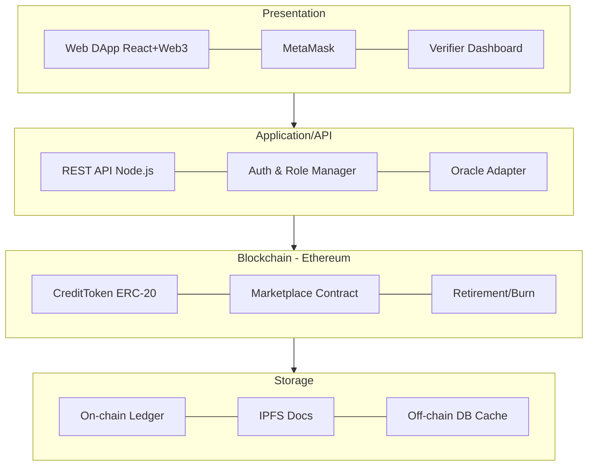

# DA1 — Blockchain-Based Carbon Credit Trading System

**Course:** Blockchain Technology · **Assessment:** Digital Assignment 1 (DA1)
**SDG Alignment:** SDG 13 — Climate Action (supporting SDG 7, SDG 12)

---

## 1. Problem Statement, Objectives, and Scope

### 1.1 Problem Statement
Carbon credits are a market-based instrument used to fight climate change: one credit represents the right to emit one tonne of CO₂, and organisations that cut their emissions can sell surplus credits to those that exceed their limits. In principle this rewards decarbonisation. In practice the current carbon-credit market is undermined by four structural failures:

1. **Double-counting** — the same credit is sold to multiple buyers because national and private registries are siloed and do not reconcile with one another.
2. **Opacity** — buyers, regulators, and the public cannot independently verify that a credit is genuine or that the underlying green project (e.g. reforestation) actually delivered the promised offset.
3. **Fraud & "phantom credits"** — credits are issued for projects that never existed or that overstate their impact, with no tamper-proof record to expose them.
4. **Slow, costly verification** — auditing and settlement rely on manual, paper-based intermediaries, taking weeks to months and inflating transaction costs.

These failures erode trust in the very mechanism meant to accelerate climate action, allowing continued emissions to be "offset" by credits that deliver no real environmental benefit.

### 1.2 Objectives
- **O1.** Tokenise carbon credits as unique, non-duplicable digital assets on a public blockchain so that each credit has a single, traceable identity.
- **O2.** Automate the issuance, transfer, and permanent **retirement (burning)** of credits through smart contracts, eliminating double-counting by design.
- **O3.** Provide a transparent, immutable, publicly auditable ledger of every credit's full lifecycle from minting to retirement.
- **O4.** Reduce dependence on intermediaries, lowering verification time and transaction cost.
- **O5.** Enforce role-based authorisation (project developers, accredited verifiers, buyers, regulators) so only legitimate actors can issue or approve credits.

### 1.3 Scope
**In scope:** design of a decentralised application (DApp) on the Ethereum ecosystem; ERC-20 token contract for fungible credits; a marketplace contract for listing/buying; a retirement contract for permanent burning; role-based access control; IPFS storage for supporting project documents; and a public verification dashboard.

**Out of scope (DA1):** live integration with government registries, legally binding settlement, real-money on-ramps, and machine-learning-based project-impact estimation. DA1 covers the *problem framing, literature, blockchain justification, architecture, and project plan* — not implementation.

### 1.4 SDG Alignment
| SDG | How the project contributes |
|-----|-----------------------------|
| **SDG 13 – Climate Action** (primary) | Restores integrity to carbon markets so offsets fund *real* emission reductions. |
| **SDG 7 – Affordable & Clean Energy** | Credits generated by renewable-energy projects gain a trustworthy, tradable value. |
| **SDG 12 – Responsible Consumption & Production** | Transparent tracking discourages greenwashing and rewards genuinely sustainable producers. |

---

## 2. Literature Survey and Research Gap

### 2.1 Survey of Existing Work
| # | Work / System | Contribution | Limitation |
|---|---------------|--------------|------------|
| 1 | **Toucan Protocol** (Base Carbon Tonne) | Bridges off-chain credits onto Ethereum as tokens; introduced on-chain retirement. | Relies on trust in the off-chain bridge; criticised for tokenising low-quality legacy credits. |
| 2 | **KlimaDAO** | Uses tokenised credits as a treasury asset to raise the carbon price. | Financial/speculative focus rather than verification integrity. |
| 3 | **IBM & Energy Web – carbon tracking pilots** | Enterprise (permissioned) blockchain for corporate emissions tracking. | Not publicly auditable; limited to consortium members. |
| 4 | **Verra / Gold Standard registries (conventional)** | Established methodologies and human verification of projects. | Centralised, siloed databases; double-counting and slow settlement persist. |
| 5 | **Academic: Blockchain for carbon trading (survey papers, 2019–2023)** | Propose smart-contract-based trading and prove feasibility. | Mostly conceptual; few address the *complete mint→trade→retire* lifecycle with role control and off-chain proof anchoring. |
| 6 | **Franke et al. / EU ETS studies** | Model emission-trading schemes economically. | Do not tackle the technical trust layer that blockchain provides. |

### 2.2 Identified Research Gap
Across the literature, three gaps recur:
- **G1 — Fragmented lifecycle handling.** Most solutions tokenise *or* trade *or* retire credits, but few model the *entire* lifecycle with enforced state transitions (a credit cannot be sold after retirement).
- **G2 — Weak off-chain–on-chain trust anchoring.** Bridged credits inherit the flaws of the legacy registries they come from; there is limited work on binding verifier attestations and project evidence (via IPFS hashes) immutably to each token.
- **G3 — Missing role-based governance on a public chain.** Public solutions maximise transparency but rarely combine it with strict on-chain role control (verifier vs. developer vs. buyer vs. regulator).

**This project addresses G1–G3** by designing a single public-Ethereum system that (a) enforces the full credit lifecycle in smart-contract logic, (b) anchors verifier attestations and IPFS document hashes to every token, and (c) layers role-based access control over a fully transparent ledger.

---

## 3. Blockchain Suitability — Why Ethereum (and not Hyperledger)?

### 3.1 Is blockchain even needed? (Justification)
A quick decision test — blockchain is justified only when: multiple non-trusting parties share data, no single trusted authority should control it, an immutable audit trail is required, and disintermediation adds value. Carbon trading satisfies **all four**: polluters, project developers, verifiers, regulators, and the public do not fully trust each other; the record must be tamper-proof; and removing slow intermediaries is a core objective. A plain database controlled by one registry is exactly the *status quo that failed*.

### 3.2 Ethereum vs. Hyperledger Fabric
| Criterion | Ethereum (public) | Hyperledger Fabric (permissioned) |
|-----------|-------------------|-----------------------------------|
| Access | Permissionless — anyone can read/verify | Permissioned — invited members only |
| Public auditability | **Full** (essential here) | Limited to consortium |
| Native tokenisation | **First-class** (ERC-20 / ERC-721) | Requires custom chaincode |
| Trust model | Trustless, decentralised | Trust among known members |
| Cost | Gas fees (mitigable via L2) | No gas, but infrastructure cost |
| Throughput | Lower on L1, high on L2 | High |

### 3.3 Decision: Ethereum
Carbon credits must be verifiable by the **general public and regulators**, not just a closed consortium — this rules out a permissioned ledger and makes public **Ethereum** the correct fit:
- **Public verifiability** matches the core goal of exposing fraud and double-counting to anyone.
- **Mature token standards (ERC-20/721)** map directly onto "one credit = one non-duplicable token".
- **Largest smart-contract ecosystem** (Solidity, OpenZeppelin, MetaMask, testnets) shortens development and hardens security.
- **Layer-2 scaling (Polygon, Arbitrum)** neutralises the gas-cost objection for production.

> Hyperledger would be preferable only if credits were traded privately among a *fixed, known* set of corporations — which contradicts the public-accountability objective of this project.

---

## 4. System Architecture, Workflow, and Design

### 4.1 System Architecture
A four-layer architecture (see `diagrams/architecture.png`):

- **Presentation Layer** — React web DApp, MetaMask wallet integration, and a verifier/regulator dashboard.
- **Application / API Layer** — Node.js REST API, authentication & role manager, and an oracle adapter for off-chain data.
- **Blockchain Layer (Ethereum)** — three smart contracts: `CreditToken` (ERC-20), `Marketplace`, and `Retirement/Burn`.
- **Storage Layer** — the on-chain ledger for transaction history, **IPFS** for bulky project documents (only the hash is stored on-chain), and an off-chain database caching metadata for fast reads.

### 4.2 Workflow — Carbon Credit Lifecycle
(see `diagrams/workflow.png`)
1. A green project (reforestation, solar, etc.) is **registered** with supporting evidence.
2. An accredited **verifier approves** the project; the attestation + IPFS document hash are anchored on-chain.
3. Credits are **minted** as tokens (1 token = 1 tonne CO₂ offset).
4. A polluting company **buys** credits via the marketplace contract.
5. To offset its emissions the company **retires (burns)** the credits — permanently removing them from circulation.
6. The full history remains a **public audit trail**; a retired credit can never be resold, structurally eliminating double-counting.

### 4.3 Sequence — Buy & Retire
(see `diagrams/sequence.png`) The buyer connects a wallet and selects a credit → DApp calls `buyCredit()` → the marketplace contract transfers tokens and records the transaction on Ethereum → confirmation returns → the buyer calls `retire()` → tokens are burned permanently → an audit-proof receipt (tx hash) is returned.

### 4.4 Key Design Decisions
- **ERC-20 for fungible credits**; optionally **ERC-721** to bind a unique project identity + metadata to each batch.
- **OpenZeppelin AccessControl** for the four roles (developer, verifier, buyer, regulator).
- **IPFS content-addressing** keeps large files off-chain while their hash guarantees integrity on-chain.
- **Retirement = irreversible burn**, enforced in contract logic so double-spend is impossible.

---

## 5. Project Planning — Timeline, Milestones, Feasibility

### 5.1 Timeline & Milestones (see `diagrams/gantt.png`)
| Phase | Weeks | Milestone / Deliverable |
|-------|-------|--------------------------|
| Requirement analysis & literature survey | W0–W2 | Finalised problem statement & survey (**DA1**) |
| System design & architecture | W1–W3 | Architecture + design diagrams (**DA1**) |
| Smart-contract development (Solidity) | W3–W6 | Deployed `CreditToken`, `Marketplace`, `Retirement` contracts |
| Frontend DApp + Web3 integration | W4–W7 | Working DApp connected to MetaMask |
| Oracle / IPFS integration | W6–W8 | Off-chain evidence anchored on-chain |
| Testing on testnet (Sepolia) | W7–W9 | End-to-end lifecycle demo on testnet |
| Security audit & gas optimisation | W9–W10 | Audit report, optimised contracts |
| Documentation & final demo | W9–W11 | Final report + presentation |

### 5.2 Feasibility Analysis
- **Technical feasibility — High.** All components are mature and open-source: Solidity + OpenZeppelin, Hardhat/Truffle, React + Web3.js, MetaMask, Sepolia testnet, and IPFS. No unproven technology is required.
- **Economic feasibility — High.** Development uses free testnets and open-source tooling (zero licensing cost). Production gas costs are mitigated by deploying on a **Layer-2** (Polygon/Arbitrum).
- **Operational feasibility — Medium.** Adoption requires accredited verifiers and regulator buy-in; the system is designed to *complement* existing registries rather than replace them overnight.
- **Schedule feasibility — High.** The 11-week plan fits a single semester with clear, incremental milestones.

### 5.3 Risks & Mitigation
| Risk | Mitigation |
|------|------------|
| Off-chain data can still be falsified before minting ("garbage in") | Require multiple independent verifier attestations; anchor evidence via IPFS hash. |
| High L1 gas fees | Deploy on Layer-2; batch operations. |
| Smart-contract vulnerabilities | Use audited OpenZeppelin libraries; run static analysis (Slither) + testnet audit. |
| Regulatory acceptance | Position as an interoperable transparency layer over existing registries. |

---

## References (indicative)
1. Toucan Protocol — *Bridging carbon credits on-chain* (documentation).
2. KlimaDAO — *Tokenised carbon as a reserve asset* (whitepaper).
3. IBM & Energy Web Foundation — *Enterprise carbon-tracking pilots*.
4. Verra & Gold Standard — *Carbon credit verification methodologies*.
5. Survey papers on *Blockchain for carbon emission trading*, IEEE/Elsevier, 2019–2023.
6. OpenZeppelin — *ERC-20 and AccessControl contract libraries*.
